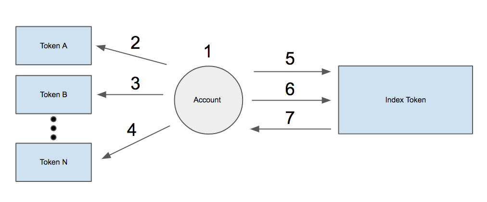
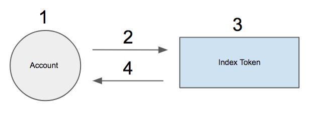

# {Set} Protocol: A Specification for Token Abstraction
```
Author: Felix Feng <felix2feng@gmail.com>
```

## Welcome to {Set}
{Set} is a specification for abstract or higher order tokens on the ethereum blockchain - written in the Solidity programming language. This repo has the `SetToken` smart contract with a suite of unit tests for the {Set} token specification. The contracts are held inside the `contracts` directory.

See the {Set} [whitepaper](https://whitepaper.setprotocol.com) for more about {Set}.


## Install and run the unit tests

1. Run npm install
```
npm install
```

2. Install [truffle](http://truffleframework.com/) and [test-rpc](https://github.com/ethereumjs/testrpc) globally
```
npm i -g ethereumjs-testrpc
npm install -g truffle
```

3. Run unit tests
```
truffle compile
truffle test
```


## Smart Contract
The {Set} contract has three functions, which are the constructor, issue, and redeem.

### Underwriting (constructor)
Underwriting is the process of creating a new {Set} contract. Anybody can create an Index Token by deploying a new {Set} contract that follows the {Set} specification to an Ethereum network. The constructor function is only called once during deployment. The required constructor parameters are below:

**Token Creation Parameters**

Parameter | Type | Description
------------ | ------------- | -------------
tokens | address[] | A list of ERC20 token addresses
units | uint[] | A list of quantities for each token

There are no restrictions to how many different ERC20 tokens can be included, aside from the transaction gas limit and data input limits. Since {Set}s are ERC20 tokens, {Set}s could be composed of other {Set}s. Deploying a {Set} creates a clean-slate contract with 0 tokens.


### Token Issuance (issue)
Token issuance is the process of generating new tokens from a {Set} Contract. Given the {Set} contract has been deployed, anybody can call the contract's `issue` function to convert a specified mix of ERC20 tokens into a token that represents its underlying parts. There only exists as many {Set} tokens as there are tokens issued less redemptions. The issue function parameters are:

**Issue Function Parameters**

Parameter | Type | Description
------------ | ------------- | -------------
quantity | uint | The quantity of {Set}s to issue

There are 7 steps to issuing a {Set} token:

<p align="center"><strong>Figure 1: {Set} Issuance Process</strong></p>
<p align="center"></p>

Figure 1 steps explained

1. Issuer decides the quantity of {Set} tokens to issue
2. Issuer calls Token A's `approve` function for the specified unit of Token A required multiplied by the quantity desired to issue
3. Issuer calls Token B's `approve` function for the specified unit of Token B required multiplied by the quantity desired to issue
4. Issue continues to call `approve` for the correct amount to all remaining tokens
5. Issuer calls the {Set} Contract's `issue` function with the desired quantity of Index Tokens to issue
6. The contract transfers the required quantities of tokens to the contracts. If any transfer is unsuccessful, the whole transaction is reverted.
7. If the previous step was sucessful, the contract increments the corresponding quantity of tokens to the issuer


### Token Redemption (redeem)
Token Redemption is the process of converting an Index Token into its underlying component tokens. Redeeming tokens reduces the token supply of {Set} tokens in the contract. The issue function parameters are:

**Redeem Function Parameters**

Parameter | Type | Description
------------ | ------------- | -------------
quantity | uint | The quantity of {Set}s to redeem

There are 4 steps to issuing a {Set} token:

<p align="center"><strong>Figure 2: {Set} Redemption Process</strong></p>
<p align="center"></p>

Figure steps explained
1. Issuer decides the quantity of {Set} tokens to redeem
2. Issuer calls the `redeem` function with the quantity to redeem
3. The contract checks to ensure that the user has enough Index tokens. The function reverts if not.
4. The contract transfers the underlying tokens to the sender and then decrements the sender's index token balance

